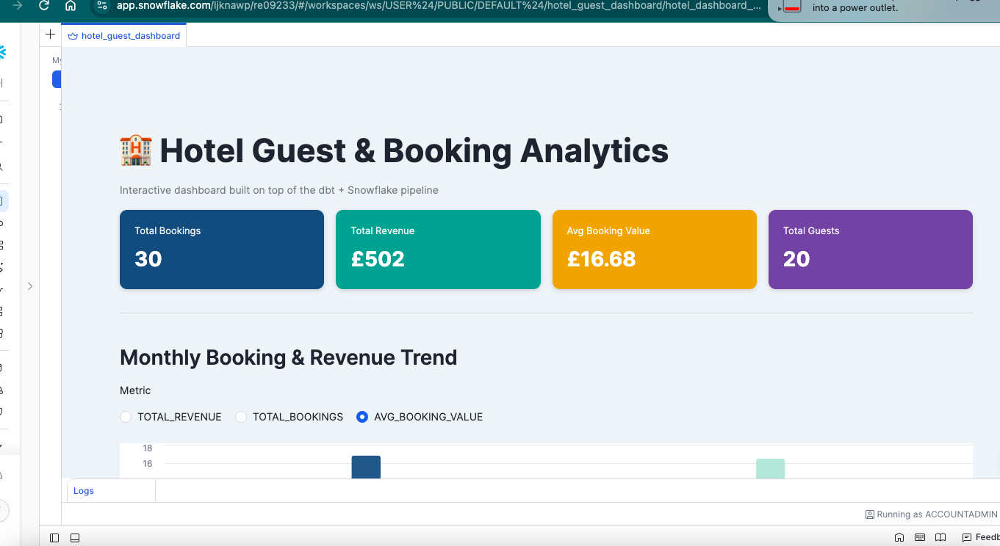
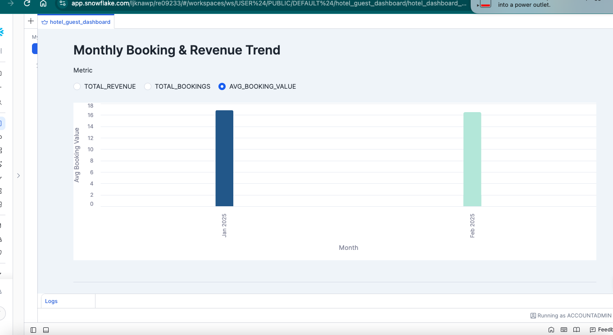
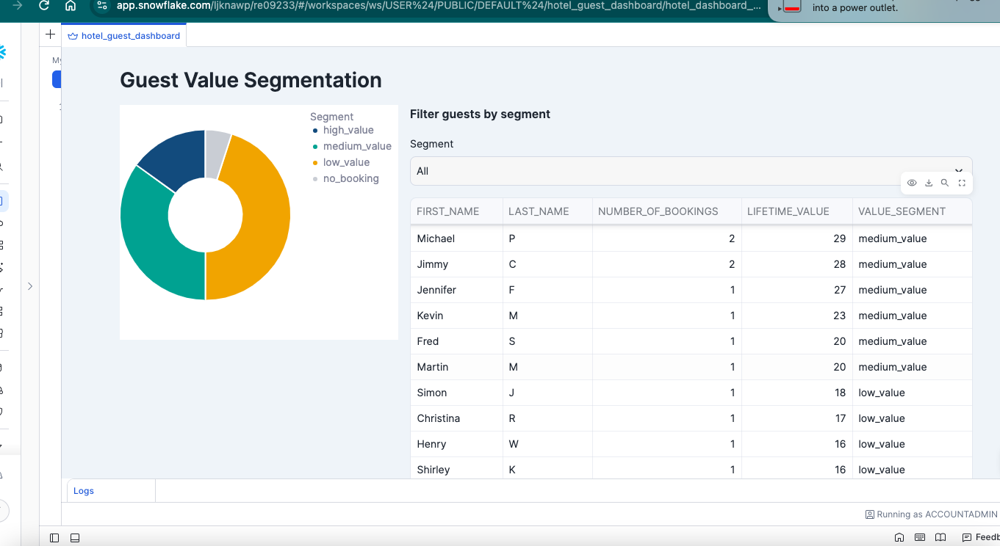

# Hotel Analytics Pipeline — dbt + Snowflake + Streamlit

An end-to-end analytics engineering pipeline built with dbt Core, modelling raw hotel guest,
booking and payment data into a clean, tested, documented set of staging and mart tables —
including a guest lifetime value (LTV) and value-segmentation model — with an interactive
Streamlit dashboard built on top for trend and segment analysis.

## Dashboard







Built with Streamlit in Snowflake — KPI summary, an interactive monthly trend chart (switchable
between revenue, bookings, and average booking value), a guest value-segment breakdown, and a
filterable guest table sorted by lifetime value.

## Why this project

Built to develop hands-on experience with modern cloud analytics engineering (dbt + Snowflake) in
a hospitality-relevant domain, directly transferable from prior ETL/data pipeline work with
Teradata and BTEQ scripting.

## Architecture

```
raw_guests ─────┐
raw_bookings ────┼──▶ staging (stg_*) ──▶ marts (fact_bookings, dim_guests)
raw_payments ────┘
```

- **Staging layer** (`models/staging/`): 1:1 cleaned/renamed views on top of raw seed data.
- **Marts layer** (`models/marts/`):
  - `fact_bookings` — one row per booking, with total payment amount attached.
  - `dim_guests` — one row per guest, enriched with booking history, **lifetime value**, and a
    simple **value_segment** (`high_value` / `medium_value` / `low_value` / `no_booking`), based
    purely on booking value and frequency.
  - `monthly_booking_trends` — booking volume, revenue, and average booking value by month, for
    time-series trend analysis.

## Scope note

This model is deliberately kept general — it segments guests by spend and frequency, but does
**not** attempt to calculate hotel revenue-management metrics such as RevPAR or ADR. The intent
was to build a solid, tested data foundation that real hospitality KPIs could be layered on top
of, rather than to claim hospitality revenue-management expertise.

## Data quality

25 automated tests across the pipeline: `not_null` and `unique` constraints on all primary keys,
`relationships` tests enforcing referential integrity between bookings → guests and payments →
bookings, and `accepted_values` tests on categorical fields (booking status, payment method,
value segment).

## Tech stack

dbt Core · Snowflake · Streamlit · SQL · Git

## Status

Built and tested locally against DuckDB during development; deployed against a Snowflake trial
instance for the final version. Data is a small representative sample (20 guests, 30 bookings,
30 payments) modelled on dbt's standard staging → mart pattern.

## Running it

```bash
dbt seed   # load raw data
dbt run    # build staging views and mart tables
dbt test   # run all data quality tests
```